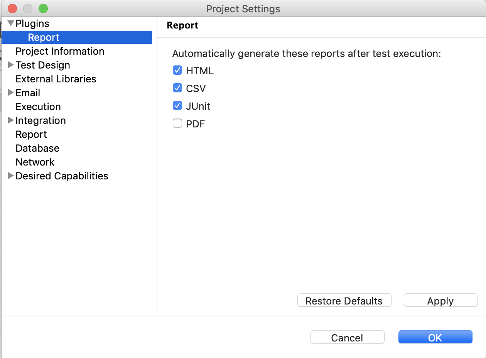
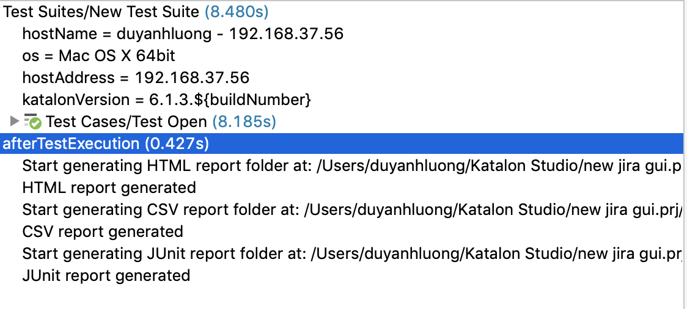
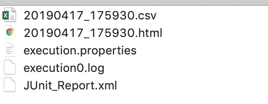

#### Automatically generate report
1. Open `Project/Settings/Plugin/Report`, select the reports that will be generated automatically after each Test Suite execution.

2. Run a test suite and observe the *Log Viewer*, the *Report Folder* after the test execution complete. The generated reports will be the same the settings you configured above.

Log Viewer after test execution

Report Folder after test execution

#### Manually export report
1. Right click on a report of Test Suite, or Test Suite Collection. Select `Export as` and choose a format to export.
